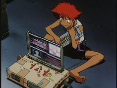

# My Summer of CS <3

## Part 1: Influencers are ProGrammers
### Programming Course
[L+Rational Class](https://github.com/hunter-teacher-cert/cohort-3-summer-work-tgrantknight-1/blob/0611d89b4d7c0882613d670a2396a9ccca94b87b/programming/6/rat/Rational.java)

## Part 2: Data Structures is like Excel but also not at all
### Data Structures Course
[Linked Lists are like the Snake Game](https://github.com/hunter-teacher-cert/cohort-3-summer-work-tgrantknight-1/blob/0611d89b4d7c0882613d670a2396a9ccca94b87b/ds/linkedlists/LinkedList.java)

## Part 3: Methods of Madness
### Methods Course
[Rally Cross? Really Cross](https://github.com/hunter-teacher-cert/cohort-3-summer-work-tgrantknight-1/blob/0611d89b4d7c0882613d670a2396a9ccca94b87b/methods/RallyCross.java)

